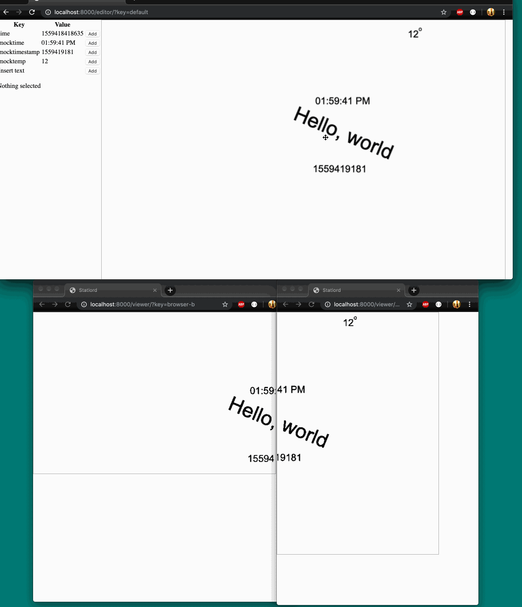
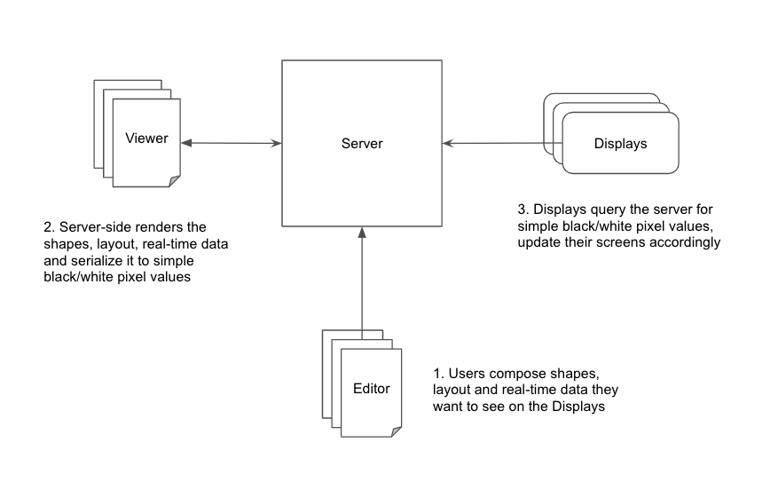

# statlord

[](https://travis-ci.org/de1ux/statlord)

> Display realtime data on spare OLEDs, e-paper, LCDs, and browsers



## Quickstart

TODO - docker image is building, but not 100% standalone/ready

## Developing

Requirements
* postgres
* python >3.5
* nodejs, npm

Install dependencies
```
$ make install
```

Run the stack
```
$ make run
```

Visit the [editor](http://0.0.0.0:8000/editor/)

## Usage (browser)

Post some data to the API

```bash
$ curl -XPUT -d '{"value": "79F"}' -H "Content-Type: application/json" http://0.0.0.0:8000/api/gauges/temperature/
```

Open the editor [http://0.0.0.0:8000/editor/](http://0.0.0.0:8000/editor/) and follow the wizard.

## Usage (other displays)

Register displays in the API with a unique name and its resolution

```bash
$ curl -XPUT \
    -d '{"resolution_x": 212, "resolution_y": 104}' \
    -H "Content-Type: application/json" \
    http://0.0.0.0:8000/api/displays/inkyphat-and-raspberry-pi-zero/

{"available":true,"resolution_x":212,"resolution_y":104,"current_layout":null}

$ curl -XPUT \
    -d '{"resolution_x": 800, "resolution_y": 480}' \
    -H "Content-Type: application/json" \
    http://0.0.0.0:8000/api/displays/hyperpixel-and-raspberry-pi/

{"available":true,"resolution_x":800,"resolution_y":480,"current_layout":null}
```

## Architecture



### Editor

Use to create layouts of different displays. Position text, gauges, and other interesting data across muliple displays.

### Viewer

A set of headless browsers that are rendering what each display "sees" in the layout. That includes rendering the latest values from a gauge.

Rendered data is currently a matrix of bits -- 0 for white, and 1 for black. 

## Displays

All of the screens that will display data. It could be a bunch of Raspberry Pis with e-paper diplays, Arduinos with oleds, browser windows -- anything that can represent bw image data.
